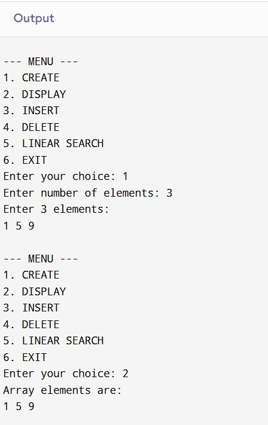
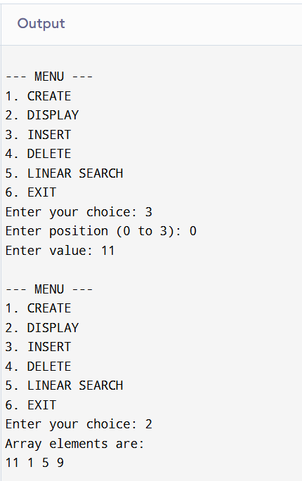
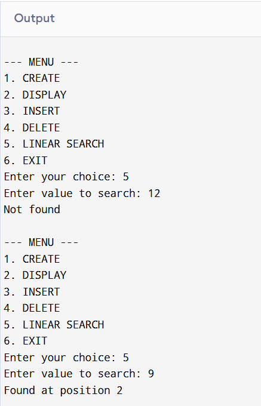
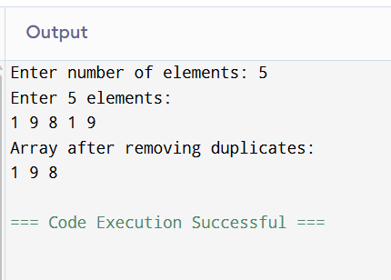
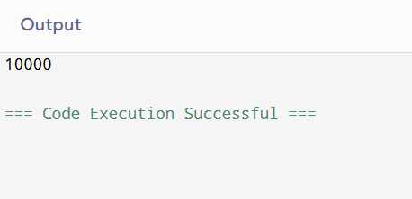
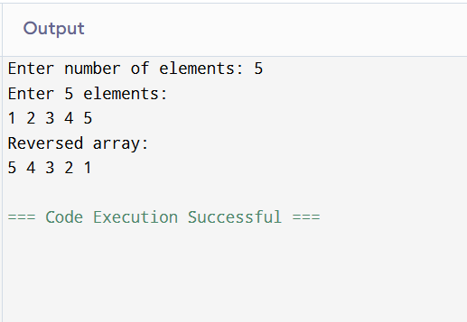
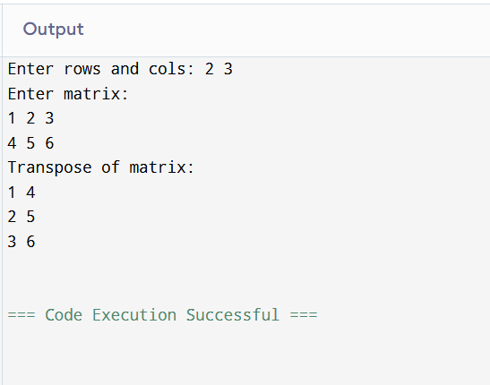

# Data Structures Lab Assignment 1

This repository contains the solutions and outputs for the first assignment.


## Question 1: Menu driven program for Array Operations

### Source Code
```c
#include <stdio.h>

int main() {
    int arr[100], n = 0, choice, pos, value, i, search, found;

    while (1) {
        printf("\n--- MENU ---\n");
        printf("1. CREATE\n2. DISPLAY\n3. INSERT\n4. DELETE\n5. LINEAR SEARCH\n6. EXIT\n");
        printf("Enter your choice: ");
        scanf("%d", &choice);

        if (choice == 1) { // CREATE
            printf("Enter number of elements: ");
            scanf("%d", &n);
            printf("Enter %d elements:\n", n);
            for (i = 0; i < n; i++) {
                scanf("%d", &arr[i]);
            }
        }

        else if (choice == 2) { // DISPLAY
            printf("Array elements are:\n");
            for (i = 0; i < n; i++) {
                printf("%d ", arr[i]);
            }
            printf("\n");
        }

        else if (choice == 3) { // INSERT
            printf("Enter position (0 to %d): ", n);
            scanf("%d", &pos);
            printf("Enter value: ");
            scanf("%d", &value);
            for (i = n; i > pos; i--) {
                arr[i] = arr[i - 1];
            }
            arr[pos] = value;
            n++;
        }

        else if (choice == 4) { // DELETE
            printf("Enter position (0 to %d): ", n - 1);
            scanf("%d", &pos);
            for (i = pos; i < n - 1; i++) {
                arr[i] = arr[i + 1];
            }
            n--;
        }

        else if (choice == 5) { // LINEAR SEARCH
            printf("Enter value to search: ");
            scanf("%d", &search);
            found = 0;
            for (i = 0; i < n; i++) {
                if (arr[i] == search) {
                    printf("Found at position %d\n", i);
                    found = 1;
                    break;
                }
            }
            if (!found) {
                printf("Not found\n");
            }
        }

        else if (choice == 6) {
            break;
        }

        else {
            printf("Invalid choice!\n");
        }
    }
    return 0;
}
```
### Output Screenshot






## Question 2: Remove duplicate elements from an array

### Source Code
```c
#include <stdio.h>

int main() {
    int arr[100], n, i, j, k;
    printf("Enter number of elements: ");
    scanf("%d", &n);
    printf("Enter %d elements:\n", n);
    for (i = 0; i < n; i++) {
        scanf("%d", &arr[i]);
    }

    for (i = 0; i < n; i++) {
        for (j = i + 1; j < n; j++) {
            if (arr[i] == arr[j]) {
                for (k = j; k < n - 1; k++) {
                    arr[k] = arr[k + 1];
                }
                n--;
                j--;
            }
        }
    }

    printf("Array after removing duplicates:\n");
    for (i = 0; i < n; i++) {
        printf("%d ", arr[i]);
    }
    return 0;
}
```
### Output Screenshot


## Question 3: Predict the Output

### Source Code
```c
#include <stdio.h>

int main() {
    int i;
    int arr[5] = {1};
    for (i = 0; i < 5; i++)
        printf("%d", arr[i]);
    return 0;
}
```

### Prediction
{1, 0, 0, 0, 0} because only the first element is explicitly set to 1, others default to 0.

### Output Screenshot


## Question 4a: Reverse the elements of an array

### Source Code
```c
#include <stdio.h>

int main() {
    int arr[100], n, i, temp;
    printf("Enter number of elements: ");
    scanf("%d", &n);
    printf("Enter %d elements:\n", n);
    for (i = 0; i < n; i++) {
        scanf("%d", &arr[i]);
    }

    for (i = 0; i < n / 2; i++) {
        temp = arr[i];
        arr[i] = arr[n - i - 1];
        arr[n - i - 1] = temp;
    }

    printf("Reversed array:\n");
    for (i = 0; i < n; i++) {
        printf("%d ", arr[i]);
    }
    return 0;
}
```
### Output


## Question 4b: Matrix multiplication

### Source Code
```c
#include <stdio.h>

int main() {
    int a[10][10], b[10][10], c[10][10];
    int r1, c1, r2, c2, i, j, k;

    printf("Enter rows and cols for first matrix: ");
    scanf("%d %d", &r1, &c1);
    printf("Enter rows and cols for second matrix: ");
    scanf("%d %d", &r2, &c2);

    if (c1 != r2) {
        printf("Matrix multiplication not possible.\n");
        return 0;
    }

    printf("Enter first matrix:\n");
    for (i = 0; i < r1; i++)
        for (j = 0; j < c1; j++)
            scanf("%d", &a[i][j]);

    printf("Enter second matrix:\n");
    for (i = 0; i < r2; i++)
        for (j = 0; j < c2; j++)
            scanf("%d", &b[i][j]);

    for (i = 0; i < r1; i++) {
        for (j = 0; j < c2; j++) {
            c[i][j] = 0;
            for (k = 0; k < c1; k++) {
                c[i][j] += a[i][k] * b[k][j];
            }
        }
    }

    printf("Resultant matrix:\n");
    for (i = 0; i < r1; i++) {
        for (j = 0; j < c2; j++) {
            printf("%d ", c[i][j]);
        }
        printf("\n");
    }
    return 0;
}
```
### Output


## Question 4c: Transpose of a Matrix

### Source Code
```c
#include <stdio.h>

int main() {
    int a[10][10], transpose[10][10];
    int r, c, i, j;

    printf("Enter rows and cols: ");
    scanf("%d %d", &r, &c);

    printf("Enter matrix:\n");
    for (i = 0; i < r; i++)
        for (j = 0; j < c; j++)
            scanf("%d", &a[i][j]);

    for (i = 0; i < r; i++)
        for (j = 0; j < c; j++)
            transpose[j][i] = a[i][j];

    printf("Transpose of matrix:\n");
    for (i = 0; i < c; i++) {
        for (j = 0; j < r; j++) {
            printf("%d ", transpose[i][j]);
        }
        printf("\n");
    }
    return 0;
}
```

### Output


## Question 5: Sum of every row and column in a 2D array

### Source Code
```c
#include <stdio.h>

int main() {
    int a[10][10];
    int r, c, i, j, sum;

    printf("Enter rows and cols: ");
    scanf("%d %d", &r, &c);

    printf("Enter matrix:\n");
    for (i = 0; i < r; i++)
        for (j = 0; j < c; j++)
            scanf("%d", &a[i][j]);

    for (i = 0; i < r; i++) {
        sum = 0;
        for (j = 0; j < c; j++) {
            sum += a[i][j];
        }
        printf("Sum of row %d = %d\n", i, sum);
    }

    for (j = 0; j < c; j++) {
        sum = 0;
        for (i = 0; i < r; i++) {
            sum += a[i][j];
        }
        printf("Sum of column %d = %d\n", j, sum);
    }
    return 0;
}
```

### Output

